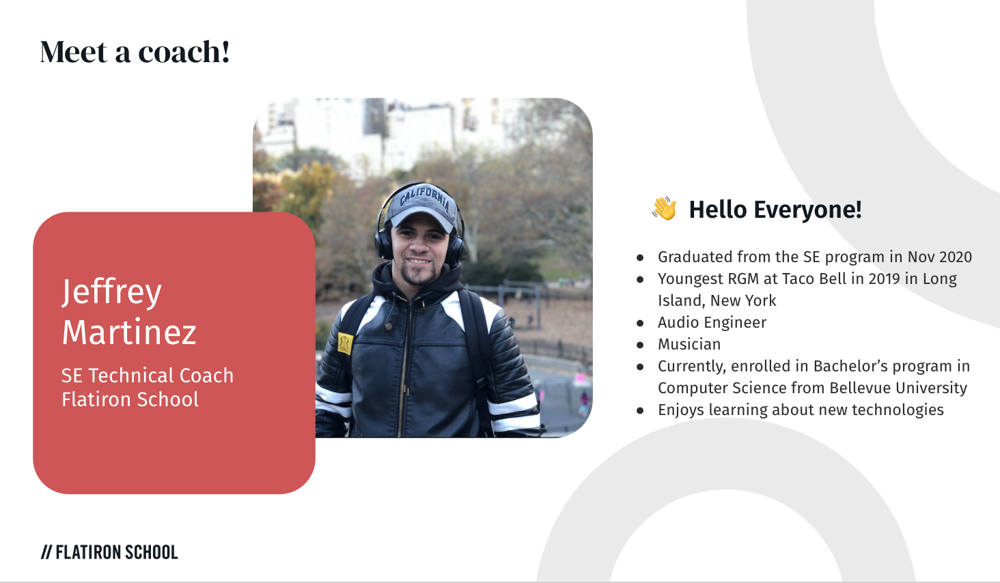
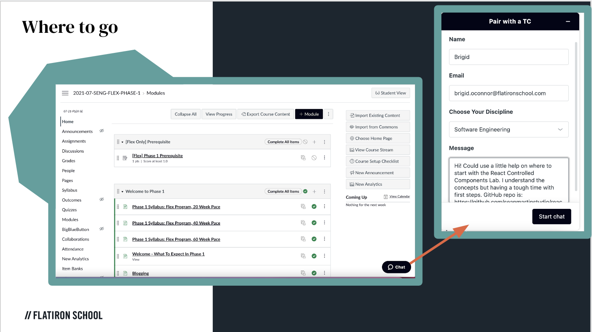
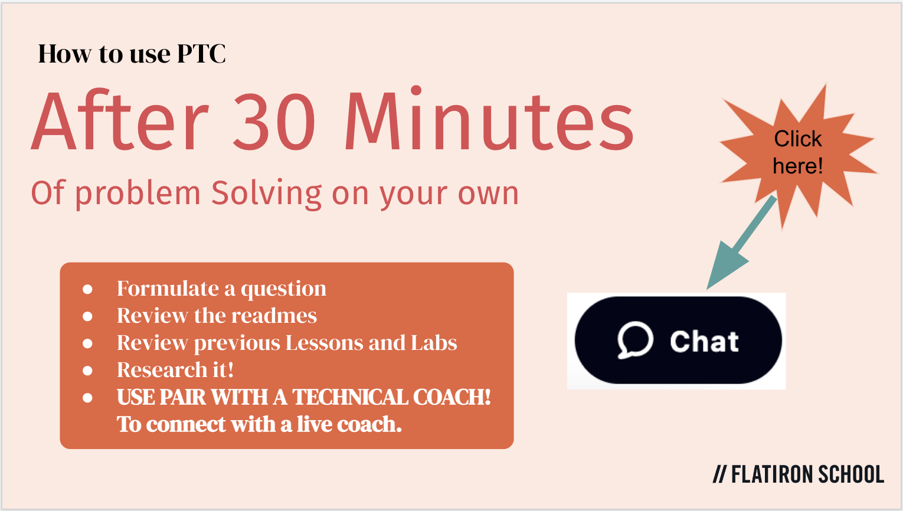

# What is Pair with a Technical Coach (PTC)

**Live 1:1 technical support for you as you are working through your labs.**  

## Why it is important
This is challenging material and you will find yourself in situations where you don’t know how to move forward or what to try next.  Learning how and when to ask for help is imperative to your success. 

- Assist in understanding concepts to proceed with next steps
- Help you become an independent problem-solver
- Solidify the concepts that you are learning
- Build your technical communication skills 
- How to learn in a collaborative environment 

## Who are the coaches?
We are a team of trained technical coaches.  We are Flatiron School Graduates and software
engineering professionals who are excited to support you and give back to the Flatiron 
School community. 

## When to ask for help

It is important to know when to reach out for help. Waiting too long can build frustration that hinders your learning.  Coming in too soon prevents you from learning by trial and error and can hold you back from developing problem-solving skills.  Learning how to effectively problem-solve on your own is paramount to your success in the program and the industry.  We are here to help you once you’ve exhausted all of your options on your own. The general rule is to troubleshoot for 30 minutes before asking for help. 

- Live/In Person
    - Monday - Friday 6pm-Midnight (Eastern)
    - Saturday & Sunday 9am-Midnight (Eastern) 
- Flex 
    - 7 days a week  9am-Midnight (Eastern)

*Times are subject to change for Holidays 

## Where can you find us?
In canvas, there is a chat feature in the bottom right-hand corner of your lessons that 
will get you connected to a live coach in real-time. 

## How to connect to a Live Coach
Once you’ve done some troubleshooting on your own and are still stuck, you’ll click on the chat feature in canvas to connect with a coach.  We’ll ask you a few questions upfront before offering a zoom link for a 1:1 screen share session.

## What to expect 

- 20-25 minute session with a coach via chat and zoom screen shares
- We will ask you questions to help you break down concepts and guide you toward a solution
- We don’t give out answers, we guide you to solutions! 
- Model problem-solving strategies you can apply to your coursework and on the job 

Remember to be kind to the coaches that are here to help you. Happy Coding and we’ll see 
you soon! 

<!-- Images Used -->

